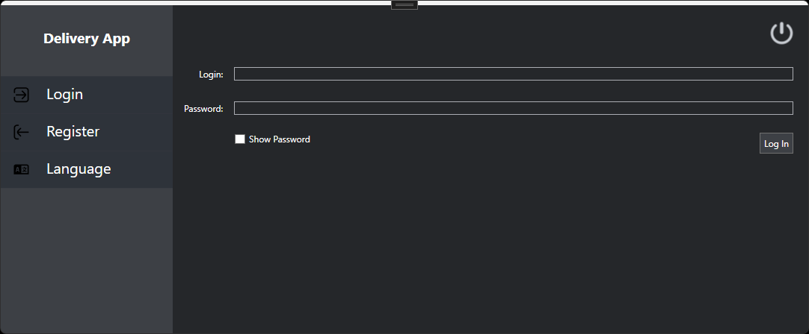
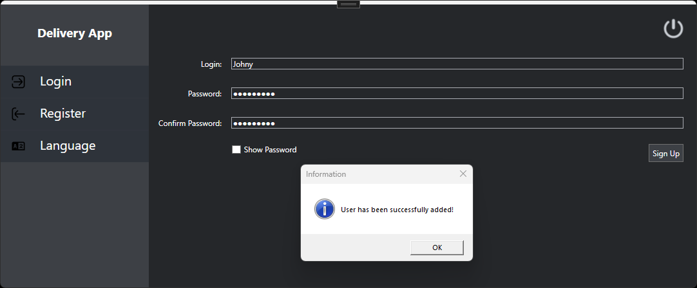
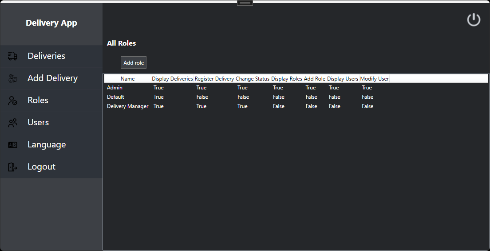
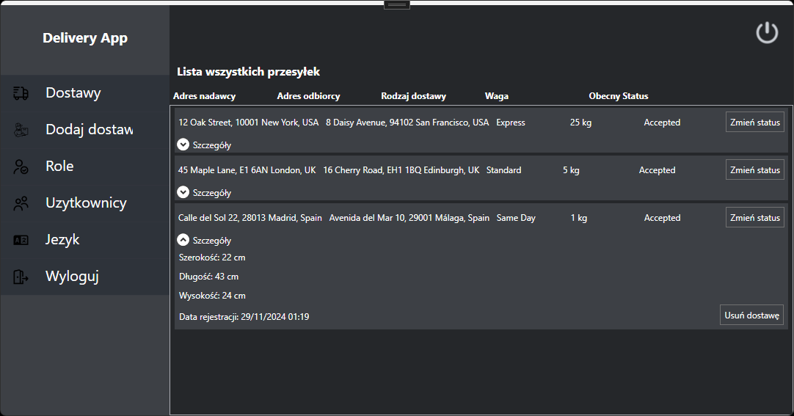
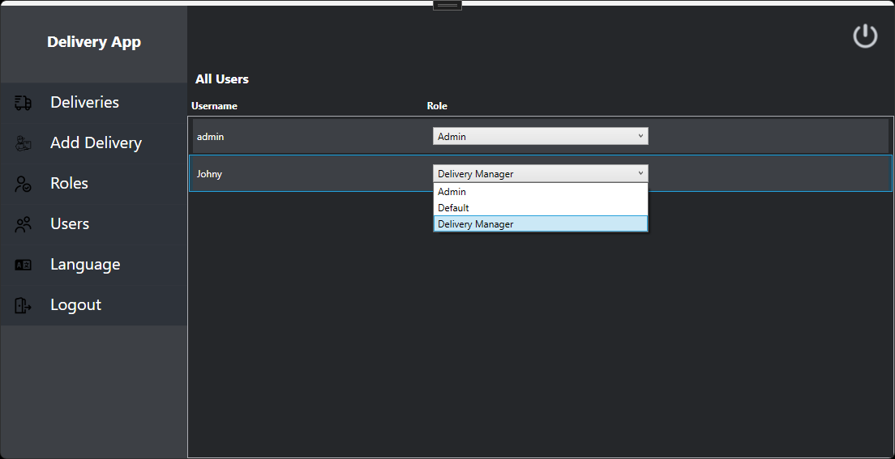
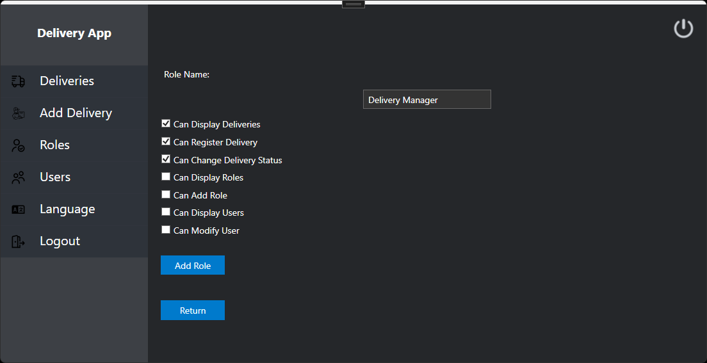
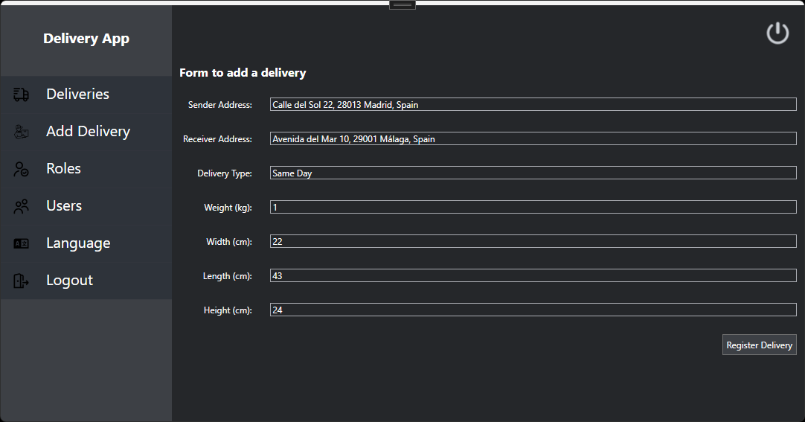

# Courier Application

A desktop application for managing a courier company. It allows users to add shipment details, monitor their status, and update delivery progress.

## Features

### User Authentication
- **Login/Registration**:  
  Enables users to create an account and access the system with their credentials.

### Shipment Management
- **Add Shipment**:  
  Allows users to add new shipments to the system.  
- **View Shipments**:  
  Displays a list of all shipments registered in the system.  
- **View Shipment Details and Update Status**:  
  Provides detailed information about a specific shipment and allows status updates.

### Role Management
- **View Roles**:  
  Displays a list of roles and permissions available in the system.  
- **Add New Role**:  
  Allows administrators to create new roles with specific permissions.  
- **Edit User Permissions**:  
  Displays a list of users and enables permission updates for them.

### Language Settings
- **Change Language**:  
  Allows users to switch the language of the interface.

  ## Technologies Used
- **.NET 8.0**  
- **WPF (Windows Presentation Foundation)**  
- **Entity Framework Core**

## Screenshots from application

### Login

### Register

### Roles

### Deliveries

### All Users

### Add Role

### Add Delivery

